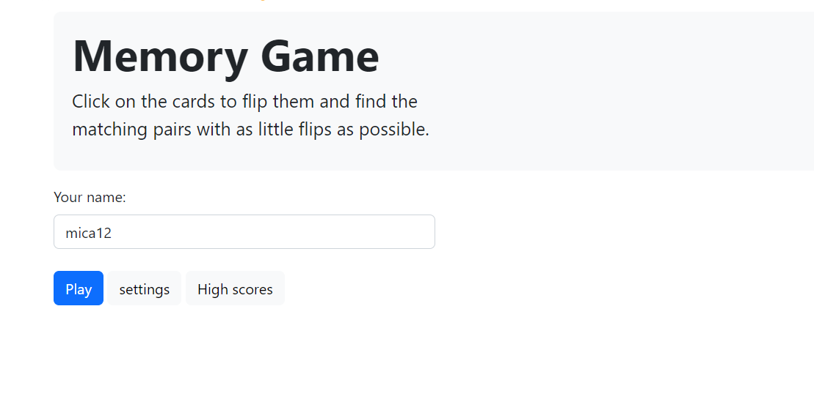

# Memory game

# Authors: Micha_Briskman

In this exercise we made a memory game. 
First you need to register, there is also an option of choosing the size of the board:  
 

 
There is a class Board that contains the class cards. 
 

 
The program prints the scores of the players. 
The score is calculated by this formula: 
player.score = Math.max(5, 30 + (player.rows*player.cols/2) + (player.rows*player.cols - steps) - 2*player.delay); / 
The cards of the board are shuffled with the Fisher–Yates algorithm 
 

